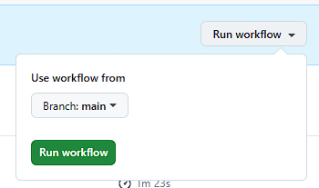
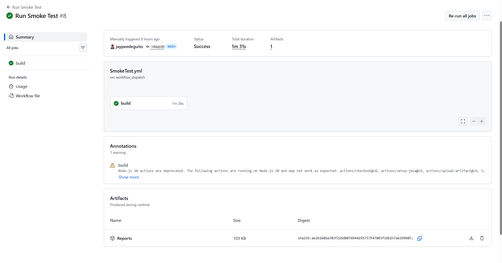
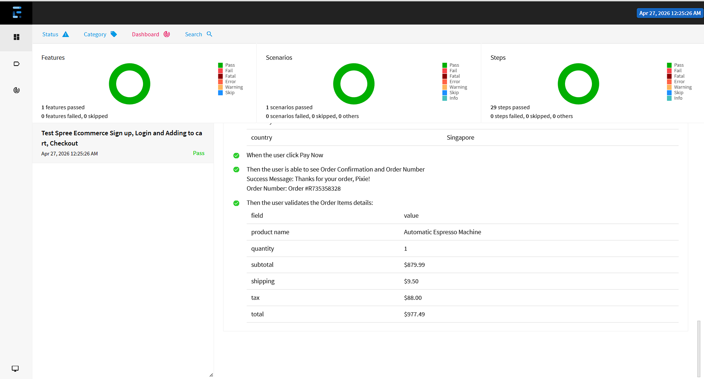

# Test Automation Coding Challenge

A modern test automation framework built as part of a coding challenge. This project demonstrates clean code practices, robust test automation design, and best practices in UI testing.

## 📋 Project Overview

This repository contains an automated test suite for Spree Commerce (https://demo.spreecommerce.org/). The framework is designed to be **scalable**, **maintainable**, and **easy to extend**.

## 🛠 Tech Stack

- **Framework**: Playwright
- **Language**: Java | Cucumber
- **Test Runner**: TestNG
- **Reporting**: ExtentReports
- **Build Tool**: Maven
- **CI/CD**: GitHub Actions

## 🚀 Quick Start

### Prerequisites

- Java 17+
- Maven
- Git
- Intellij
- Chrome

### Installation

```
# Clone the repository
git clone https://github.com/jaypeedeguito/globe_qe_challenge.git
cd globe_qe_challenge

# Install dependencies
mvn clean install
```

## 🎯Running Tests Locally

```
# To run in normal mode
mvn clean test -PLocal

# To run in headless mode
mvn clean test -PCI
```

## ⚡Running Tests in GitHub Actions
[](https://github.com/jaypeedeguito/globe_qe_challenge/actions/workflows/SmokeTest.yml)

### Workflow Features
- Runs on manual trigger
- Automatic Extent Report Generation
- Uploads artifacts (Reports)

### Workflow File Location
```
.github/workflows/SmokeTest.yml
```

### How to Trigger the Workflow
- Manually trigger from the Actions tab in GitHub
- Actions > workflows > SmokeTest.yml > Run Workflow
- Download the Reports





## Test Reports
After execution, reports are generated in:
```
globe_qe_challenge/
├── Reports/                
│   ├── ExtentReport.html   # ExtentReport html
│   ├── index.html          # Extent Spark
│   └── PDF.pdf             # ExtentReport pdf

```

### Extent Reports


## 📁 Project Structure
This Framework uses the automation pattern [Page Object Model] and is structured as follows.
```
globe_qe_challenge/src

├── main/                   
│   └── java/
│       └── come.core/
│           ├── hooks/              # Cucumber hook (Browser configurations)
│           └── utility/            # Helper class           
│
│
├── tests/                  
│   ├── java/
│   │   ├── locators/               # Locators of the Page Objects
│   │   ├── pages/                  # Page Objects
│   │   ├── runner/                 # Cucumber testng runner
│   │   └── steps/                  # Cucumber step definition
│   │
│   └── resources/
│       ├── config/                 # Config properties
│       ├── features/               # Cucumber test cases
│       ├── extent.properties 
│       └── extent-config.xml
│
│
├── Reports/                        # Test reports
├── .github/workflows/              # CI/CD pipelines
├── pom.xml
└── README.md
```
### Sample Feature file (Test)
```
Feature: Test Spree Ecommerce Sign up, Login and Adding to cart, Checkout

  @Smoke
  Scenario: User validate E2E Sign up, Login and Adding to cart, Checkout
    Given the user is on the Spree Store home page
    When the user clicks the Account icon in the top menu bar
    Then the user is navigated to the Account Login page
    When the user clicks the Sign Up link
    # SIGN UP
    Then the user is navigated to the Create Account page
    When the user create a new account:
      | field            | value            |
      | first name       | Pixie            |
      | last name        | Dust             |
      | email            | <auto.generated> |
      | password         | P!xie001122      |
      | confirm password | P!xie001122      |
    Then the user is navigated to the Account Overview page
    When the user sign out from the page
    Then the user is navigated to the Account Login page
    When the user sign in back using the new account created
    Then the user is navigated to the Account Overview page
    # BROWSER PRODUCT
    When the user clicks the Hamburger top menu icon in the top menu bar
    When the user clicks the All Products menu in the side menu bar
    Then the user is navigated to the All Products page
    When the user clicks the Product "Automatic Espresso Machine"
    Then the user is able to see the product details:
      | field        | value                                                                                                                                                                                                      |
      | product name | Automatic Espresso Machine                                                                                                                                                                                 |
      | price        | $879.99                                                                                                                                                                                                    |
      | description  | Fully automatic bean-to-cup espresso machine with ceramic grinder, 15-bar pressure system, and intuitive touch display. Delivers barista-quality espresso, cappuccino, and latte at the touch of a button. |
    # ADD TO CART
    When the user click Add To Cart button
    When the user click View Cart
    # VALIDATE SHOPPING CART
    Then the user is navigated to the Shopping Cart page
    Then the user validates the shopping cart details:
      | field        | value                      |
      | product name | Automatic Espresso Machine |
      | price        | $879.99                    |
      | quantity     | 1                          |
    # PROCEED TO CHECKOUT
    When the user click Proceed To Checkout
    Then the user is navigated to the Checkout page
    When the user fill the shipping address details:
      | field           | value              |
      | country         | United States      |
      | address         | 401 Seaward Rd #17 |
      | city            | Lakers             |
      | state/province  | California         |
      | zip/postal code | 92625              |
      | phone           | 213-555-0123       |
    When the user select the Shipping Method as Premium
    When the user select the Payment Method as Credit Card
    When the user fill the Credit Card details:
      | field           | value            |
      | card number     | 4000002500001001 |
      | expiration date | 01/30            |
      | security code   | 123              |
      | country         | Singapore        |
    When the user click Pay Now
    # VALIDATE ORDER CONFIRMATION
    Then the user is able to see Order Confirmation and Order Number
    Then the user validates the Order Items details:
      | field        | value                      |
      | product name | Automatic Espresso Machine |
      | quantity     | 1                          |
      | subtotal     | $879.99                    |
      | shipping     | $9.50                      |
      | tax          | $88.00                     |
      | total        | $977.49                    |

```
### Sample Locator class
```
package locators;

public class CheckoutLocators {
    public static final String CHECKOUT_SECTION_XPATH = "//div[@id='checkout-section-address']";
    public static final String COUNTRY_DROPDOWN_XPATH = "//select[@id='ship-country']";

    public static final String ADDRESS_TEXTBOX_XPATH = "//input[@id='ship-address1']";
    public static final String CITY_TEXTBOX_XPATH = "//input[@id='ship-city']";
    public static final String STATE_TEXTBOX_XPATH = "//select[@id='ship-state']";
    public static final String ZIP_TEXTBOX_XPATH = "//input[@id='ship-postal_code']";
    public static final String PHONE_TEXTBOX_XPATH = "//input[@id='ship-phone']";
    public static final String PREMIUM_BUTTON_XPATH = "//span[.='Premium']";

    public static final String PAY_NOW_XPATH = "//button[.='Pay Now']";

    public static final String CARD_RADIO_BUTTON_XPATH = "//button[@id='card-tab']//span";
    public static final String CARD_NUMBER_TEXTBOX_XPATH = "//input[@id='payment-numberInput']";
    public static final String EXPIRATION_DATE_TEXTBOX_XPATH = "//input[@id='payment-expiryInput']";
    public static final String SECURITY_CODE_TEXTBOX_XPATH = "//input[@id='payment-cvcInput']";
    public static final String COUNTRY_PAYMENT_DROPDOWN_XPATH = "//select[@id='payment-countryInput']";
    public static final String IFRAME_XPATH = "//iframe[@*='Secure payment input frame']";
}
```
### Sample Page object class
```
package pages;

import com.core.utility.BasePage;
import com.microsoft.playwright.Locator;
import com.microsoft.playwright.assertions.LocatorAssertions;
import com.microsoft.playwright.options.SelectOption;
import com.microsoft.playwright.options.WaitForSelectorState;
import io.cucumber.datatable.DataTable;
import locators.CheckoutLocators;

import java.util.List;
import java.util.Map;

import static com.microsoft.playwright.assertions.PlaywrightAssertions.assertThat;

public class CheckoutPage extends BasePage {

    public void verifyCheckoutPage() {
        assertThat(page.get().locator(CheckoutLocators.CHECKOUT_SECTION_XPATH)).isVisible(new LocatorAssertions.IsVisibleOptions().setTimeout(15000));
    }

    public void fillShippingAddress(DataTable dt) {
        List<Map<String, String>> rows = dt.asMaps(String.class, String.class);
        String field, value;
        for (Map <String, String> columns : rows) {
            field = columns.get("field");
            value = columns.get("value");
            fillShippingAddress(field, value);
        }
    }

    public void fillShippingAddress(String field, String value) {
        switch (field.toLowerCase()) {
            case "country":
                BasePage.selectOptionFromLabel(CheckoutLocators.COUNTRY_DROPDOWN_XPATH, value);
                break;
            case "address":
                BasePage.clearInput(CheckoutLocators.ADDRESS_TEXTBOX_XPATH);
                BasePage.setTextToInputWithoutClear(CheckoutLocators.ADDRESS_TEXTBOX_XPATH, value);
                break;
            case "city":
                BasePage.clearInput(CheckoutLocators.CITY_TEXTBOX_XPATH);
                BasePage.setTextToInputWithoutClear(CheckoutLocators.CITY_TEXTBOX_XPATH, value);
                break;
            case "state/province":
                BasePage.selectOptionFromLabel(CheckoutLocators.STATE_TEXTBOX_XPATH, value);
                break;
            case "zip/postal code":
                BasePage.clearInput(CheckoutLocators.ZIP_TEXTBOX_XPATH);
                BasePage.setTextToInputWithoutClear(CheckoutLocators.ZIP_TEXTBOX_XPATH, value);
                break;
            case "phone":
                BasePage.clearInput(CheckoutLocators.PHONE_TEXTBOX_XPATH);
                BasePage.setTextToInputWithoutClear(CheckoutLocators.PHONE_TEXTBOX_XPATH, value);
                page.get().keyboard().press("Tab");
                break;
            default:

        }
    }

    public void fillCreditCardDetails(DataTable dt) {
        List<Map<String, String>> rows = dt.asMaps(String.class, String.class);
        String field, value;
        for (Map <String, String> columns : rows) {
            field = columns.get("field");
            value = columns.get("value");
            fillCreditCardDetails(field, value);
        }
    }

    public void fillCreditCardDetails(String field, String value) {
        switch (field.toLowerCase()) {
            case "country":
                getFrameLocator(CheckoutLocators.IFRAME_XPATH)
                        .locator(CheckoutLocators.COUNTRY_PAYMENT_DROPDOWN_XPATH).selectOption(new SelectOption().setLabel(value));
//                BasePage.selectOptionFromLabel(CheckoutLocators.COUNTRY_PAYMENT_DROPDOWN_XPATH, value);
                break;
            case "card number":
                getFrameLocator(CheckoutLocators.IFRAME_XPATH)
                        .locator(CheckoutLocators.CARD_NUMBER_TEXTBOX_XPATH).fill(value);
                break;
            case "expiration date":
                getFrameLocator(CheckoutLocators.IFRAME_XPATH)
                        .locator(CheckoutLocators.EXPIRATION_DATE_TEXTBOX_XPATH).fill(value);
                break;
            case "security code":
                getFrameLocator(CheckoutLocators.IFRAME_XPATH)
                        .locator(CheckoutLocators.SECURITY_CODE_TEXTBOX_XPATH).fill(value);
                break;
            default:
        }
    }

    public void clickPayNow() {
        setClickElement(CheckoutLocators.PAY_NOW_XPATH);
    }

    public void clickCreditCard() {
        int ctr = 1;
        while (ctr <= 3) {
            ctr++;
            try {
                getFrameLocator(CheckoutLocators.IFRAME_XPATH).locator(CheckoutLocators.CARD_RADIO_BUTTON_XPATH)
                        .waitFor(new Locator.WaitForOptions().setState(WaitForSelectorState.VISIBLE).setTimeout(15000));
                getFrameLocator(CheckoutLocators.IFRAME_XPATH).locator(CheckoutLocators.CARD_RADIO_BUTTON_XPATH).click();
//                setClickElement(CheckoutLocators.CARD_RADIO_BUTTON_XPATH);
                break;
            } catch (Exception e) {
            }
        }

    }

    public void clickPremium() {
        setClickElement(CheckoutLocators.PREMIUM_BUTTON_XPATH);
        try {
            Thread.sleep(5000);
        } catch (InterruptedException e) {
            throw new RuntimeException(e);
        }
    }
}
```

### Sample Step Definition class
```
package steps;

import io.cucumber.datatable.DataTable;
import io.cucumber.java.en.Then;
import io.cucumber.java.en.When;
import pages.CheckoutPage;

public class CheckoutSteps {
    /*
     ** PAGE INSTANCE **
     */

    CheckoutPage checkoutPage = new CheckoutPage();

    @Then("the user is navigated to the Checkout page")
    public void the_user_nav_checkout_account() {
        checkoutPage.verifyCheckoutPage();
    }

    @When("the user fill the shipping address details:")
    public void the_user_fill_shipping(DataTable dt) {
        checkoutPage.fillShippingAddress(dt);
    }

    @When("the user click Pay Now")
    public void the_user_click_pay_now() {
        checkoutPage.clickPayNow();
    }

    @When("the user select the Payment Method as Credit Card")
    public void the_user_click_credit_card() {
        checkoutPage.clickCreditCard();
    }

    @When("the user select the Shipping Method as Premium")
    public void the_user_click_shipping_method() {
        checkoutPage.clickPremium();
    }

    @When("the user fill the Credit Card details:")
    public void the_user_fill_credit_card(DataTable dt) {
        checkoutPage.fillCreditCardDetails(dt);
    }

}
```
